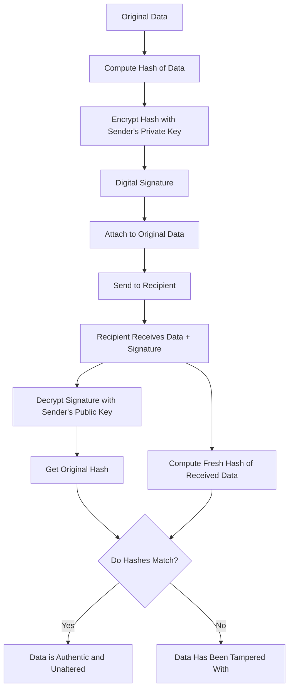
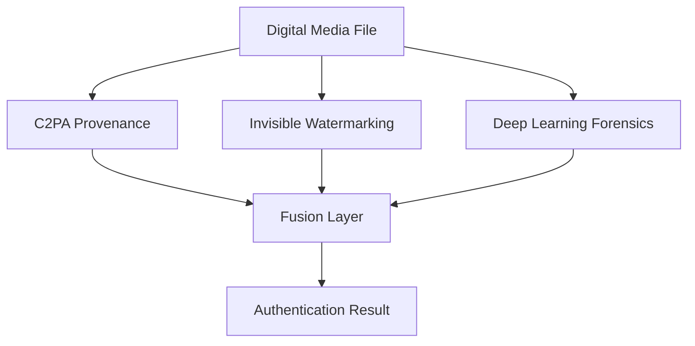
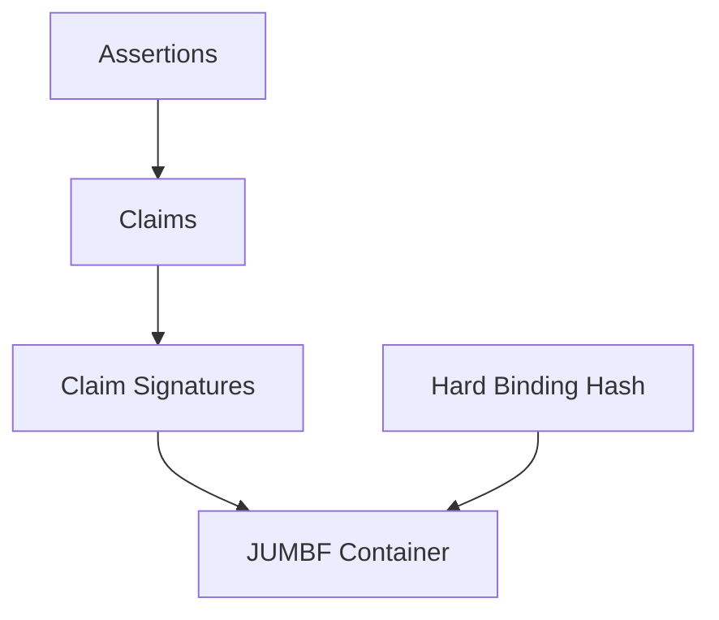
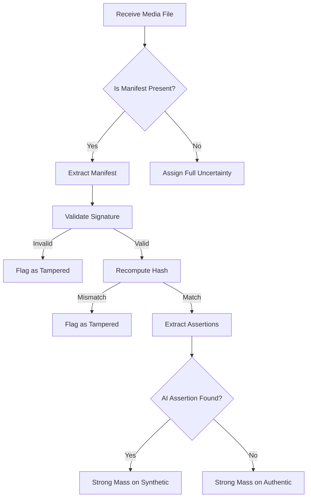
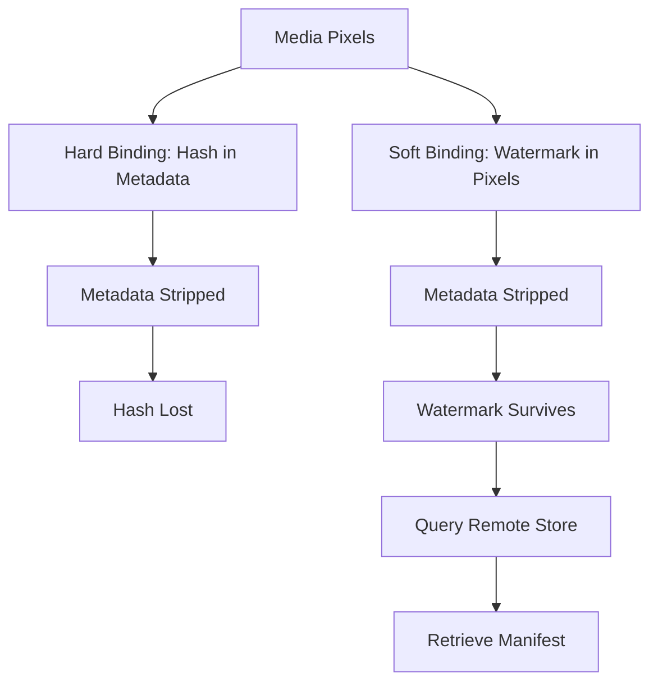
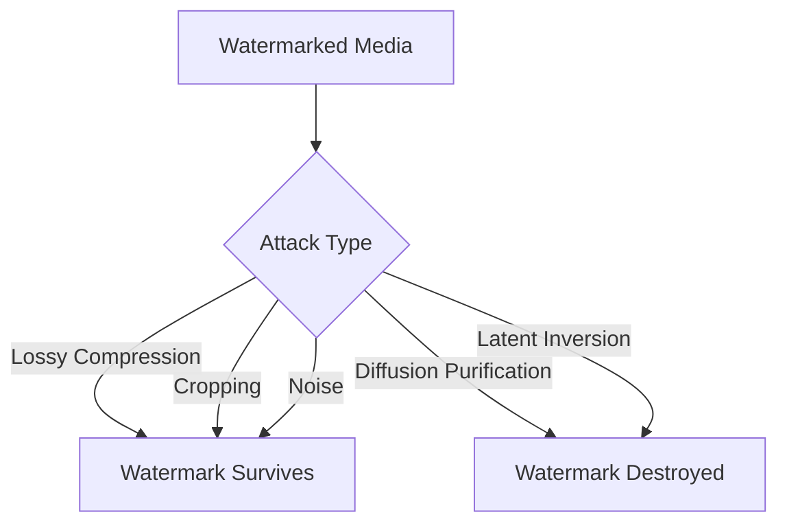
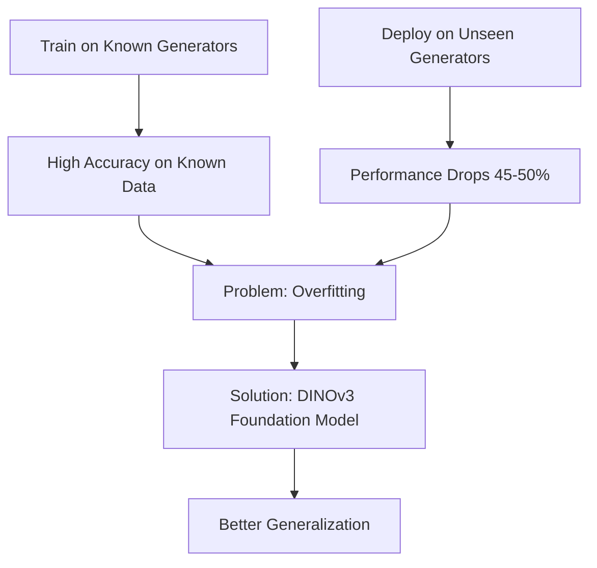
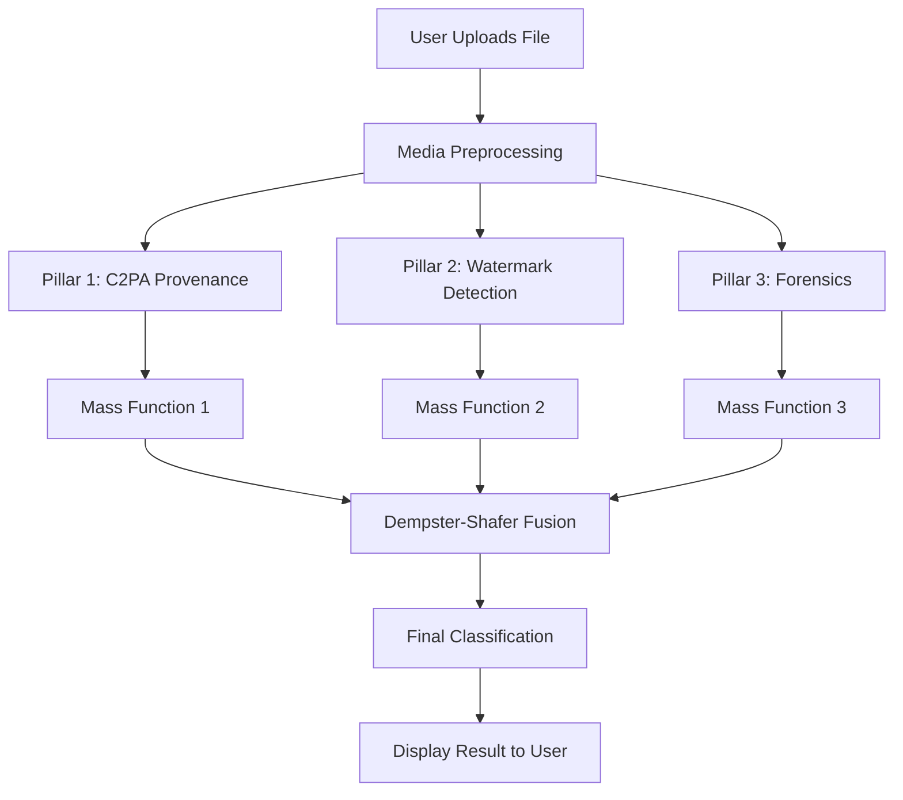
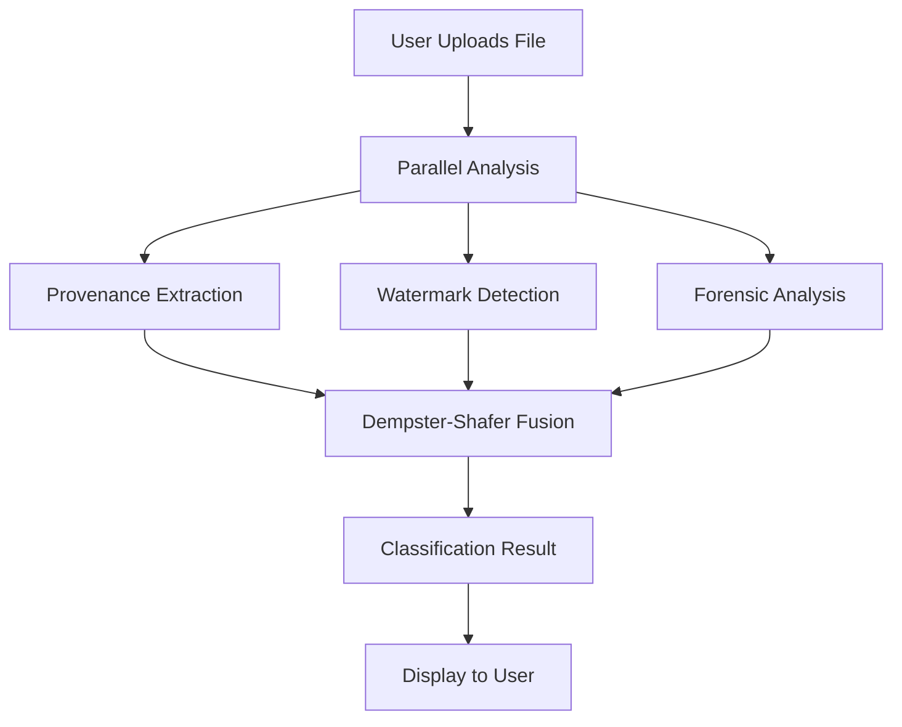

# Toward Robust AI Media Authentication
## A Proposed Hybrid Framework Integrating Provenance, Watermarking, and Deep Learning Forensics

---

## 0. Foundation: Key Concepts Explained

Before we dive into the framework, let's understand the fundamental building blocks.

### 0.1 What is Cryptography?

**Cryptography** is the practice of securing information by transforming it into a format that cannot be read or tampered with by unauthorized parties.

**Key Concepts in Cryptography:**

| Term | Simple Explanation |
|------|-------------------|
| **Encryption** | Scrambling data so only authorized parties can read it |
| **Decryption** | Unscrambling encrypted data back to its original form |
| **Cryptographic Hash** | A mathematical function that converts any input into a fixed-size string of characters. If the input changes even slightly, the hash changes completely |
| **Digital Signature** | A cryptographic proof that a message came from a specific sender and was not altered |
| **Public Key Infrastructure (PKI)** | A system that manages digital certificates and public-private key pairs to verify identities |
| **Public Key** | A key that can be shared openly, used to verify signatures |
| **Private Key** | A secret key held only by the owner, used to create signatures |
| **Certificate Authority** | A trusted third party that issues digital certificates verifying identity |
| **X.509 Certificate** | A standard format for digital certificates that binds a public key to an identity |

### 0.2 What is a Hash?

A **hash** is like a digital fingerprint of data.

**Properties of a Good Hash Function:**

- **Deterministic:** Same input always produces same output
- **Fast to compute:** Can hash large files quickly
- **Irreversible:** Cannot reconstruct the original data from the hash
- **Avalanche Effect:** Changing even one bit of input changes the hash completely
- **Collision Resistant:** Extremely difficult to find two different inputs with the same hash

**Example (Simplified):**

```
Input: "Hello World"
SHA-256 Hash: a591a6d40bf420404a011733cfb7b190d62c65bf0bcda32b57b277d9ad9f146e

Input: "Hello World!" (added exclamation mark)
SHA-256 Hash: 7f83b1657ff1fc53b92dc18148a1d65dfc2d4b1fa3d677284addd200126d9069

Notice: Completely different hashes for nearly identical inputs!
```

### 0.3 What is a Digital Signature?

A **digital signature** proves two things:

1. **Authentication:** The message genuinely came from the claimed sender
2. **Integrity:** The message was not altered during transit

**How Digital Signatures Work:**



### 0.4 What is Metadata?

**Metadata** is data about data. It provides information about a file without being part of the actual content.

**Examples of Metadata in Digital Media:**

| Metadata Type | What It Contains | Where It Lives |
|---------------|------------------|----------------|
| **EXIF Data** | Camera model, lens, exposure settings, GPS coordinates | Image file header |
| **XMP Data** | Copyright info, keywords, editing history | Image file header |
| **ID3 Tags** | Song title, artist, album, year | Audio file header |
| **Container Metadata** | Codec info, duration, bitrate | Video file header |
| **JUMBF Data** | C2PA provenance information | Image/video file header |

**Important:** Metadata lives in the file **header**, not in the actual pixels or audio samples. This is why it can be stripped without affecting how the media looks or sounds.

### 0.5 What is a Neural Network?

A **neural network** is a computational model inspired by the human brain. It consists of layers of interconnected nodes (neurons) that process information.

**Key Terms:**

| Term | Simple Explanation |
|------|-------------------|
| **Neuron** | A computational unit that receives inputs, applies a mathematical function, and produces an output |
| **Layer** | A collection of neurons that process data at a specific stage |
| **Weights** | Numerical values that determine how much influence each input has on each neuron |
| **Training** | The process of adjusting weights to minimize errors on known examples |
| **Inference** | Using a trained network to make predictions on new data |
| **Activation Function** | A mathematical function that determines whether a neuron "fires" |
| **Backpropagation** | The algorithm used to update weights during training |

### 0.6 What is a Convolutional Neural Network (CNN)?

A **Convolutional Neural Network (CNN)** is a specialized type of neural network designed to process grid-like data, such as images.

**Key Components:**

| Component | What It Does |
|-----------|--------------|
| **Convolutional Layer** | Slides small filters across the image to detect patterns like edges, textures, and shapes |
| **Pooling Layer** | Reduces the spatial size of the data, making the network more efficient |
| **Fully Connected Layer** | Makes the final classification decision based on extracted features |
| **Filter/Kernel** | A small matrix of weights that detects a specific pattern |

**What CNNs Detect in Images:**

- **Low-level features:** Edges, corners, color gradients
- **Mid-level features:** Textures, patterns, shapes
- **High-level features:** Objects, faces, scenes

### 0.7 What is a Generative AI Model?

A **generative AI model** is a system that creates new content (images, text, audio, video) that resembles the data it was trained on.

**Types of Generative Models:**

| Model Type | How It Works | Examples |
|------------|--------------|----------|
| **GAN (Generative Adversarial Network)** | Two networks compete: one generates fakes, one detects fakes | StyleGAN, BigGAN |
| **Diffusion Model** | Starts with noise and progressively removes it to create an image | Stable Diffusion, DALL-E, Midjourney |
| **VAE (Variational Autoencoder)** | Compresses data to a latent space and reconstructs from it | Used in older generative systems |
| **Transformer** | Uses self-attention to generate sequences | GPT, Claude, Gemini |

### 0.8 What is Latent Space?

**Latent space** is a compressed mathematical representation of data.

**Key Concepts:**

- Instead of working with millions of pixels, AI models work with a smaller set of numbers that capture the essential features
- This compressed representation captures the "essence" of the image
- Diffusion models generate images by working in latent space, then decoding to pixel space

**Why It Matters:**

- Watermarks embedded in latent space become part of the image's core structure
- Harder to remove without degrading image quality
- More robust than watermarks added after generation

### 0.9 What is Deep Learning?

**Deep learning** is a subset of machine learning that uses neural networks with many layers (hence "deep").

**Key Differences from Traditional Machine Learning:**

| Traditional ML | Deep Learning |
|----------------|---------------|
| Requires manual feature extraction | Learns features automatically |
| Works with small datasets | Requires large datasets |
| Simple algorithms | Complex neural architectures |
| Easy to interpret | Hard to interpret (black box) |
| Fast to train | Slow to train |

### 0.10 What is Machine Learning?

**Machine learning** is the process of teaching computers to learn from data without being explicitly programmed.

**Types of Learning:**

| Type | How It Works | Example |
|------|--------------|---------|
| **Supervised Learning** | Learns from labeled examples | Detecting deepfakes with labeled real/fake images |
| **Unsupervised Learning** | Finds patterns without labels | Clustering similar images |
| **Self-Supervised Learning** | Creates its own labels from data | DINOv3 predicting missing image patches |
| **Reinforcement Learning** | Learns through trial and error | Game-playing AI |

---

## 1. Introduction

### 1.1 The Problem

Generative Artificial Intelligence (AI) tools can now create images, videos, and audio that are indistinguishable from genuine content to the human eye and ear. This creates a significant challenge: determining whether a piece of digital media was captured by a camera or synthesized by an algorithm.

### 1.2 Why Single Solutions Fail

Traditional detection methods rely on one technique. This is insufficient because:

- **Generative models improve rapidly.** New AI models produce fewer detectable artifacts than older ones.
- **Adversaries actively evade detection.** Attackers can strip metadata, compress files, add noise, or use purification algorithms to remove traces of manipulation.
- **Single points of failure exist.** If the one method being used is bypassed, the entire system fails.

### 1.3 Our Proposed Solution

We propose a **hybrid framework** that combines three independent authentication methods into one unified system:

1. **Content Provenance (C2PA)**
2. **Invisible Watermarking**
3. **Deep Learning Forensics**

Each method works differently and fails differently. By fusing their outputs using **Dempster-Shafer Theory**, the framework remains functional even when one or more layers are attacked.

### 1.4 High-Level System Overview



---

## 2. The Three Pillars of Authentication

### 2.1 Pillar One: Content Provenance (C2PA)

#### What is C2PA?

C2PA stands for the **Coalition for Content Provenance and Authenticity**. It is an open technical standard that records the history of a digital media file.

**Breaking Down the Name:**

- **Coalition:** A group of companies working together (Adobe, Microsoft, Intel, Sony, etc.)
- **Content Provenance:** The origin and history of digital content
- **Authenticity:** Proof that content is genuine

#### Key C2PA Terminology

| Term | Simple Explanation |
|------|-------------------|
| **Manifest** | A structured record attached to media that contains its full history |
| **Assertion** | A single statement about the media (e.g., "created by camera X at time Y") |
| **Claim** | A collection of assertions bundled together and hashed |
| **Claim Signature** | Cryptographic signature over the claim, proving who made it |
| **Hard Binding** | A hash of the actual media pixels stored inside the manifest |
| **Soft Binding** | A watermark in the pixels that points to a remote manifest |
| **Trust List** | A list of certificate authorities and signers that a validator trusts |
| **JUMBF** | JPEG Universal Metadata Box Format — a standard way to store metadata in files |
| **CBOR** | Concise Binary Object Representation — a compact data format for storing structured data |
| **COSE** | CBOR Object Signing and Encryption — a standard for signing CBOR data |

#### How C2PA Works (Step by Step)

**Step 1: Media Creation**
- A camera or AI tool creates media
- The tool records what created it, when, and how

**Step 2: Assertion Creation**
- The tool generates assertions (statements about the media)
- Examples: "Created by Stable Diffusion v3", "Edited with Photoshop", "AI involved: Yes"

**Step 3: Claim Formation**
- Assertions are serialized into CBOR format
- A hash is computed over the serialized assertions
- The hash and assertions together form a claim

**Step 4: Signing**
- The claim is signed using the creator's private key
- The signature follows the COSE standard (RFC 9052)
- An X.509 certificate chain links the signature to a trusted authority

**Step 5: Embedding**
- The signed claim is packaged into a JUMBF container
- The container is embedded in the file's metadata
- A hard binding hash of the media pixels is also stored

**Step 6: Verification**
- A validator extracts the manifest from the file
- Validates the certificate chain against a trust list
- Recomputes the hard binding hash
- If the hash matches, the media is authentic
- If the hash mismatches, the media was tampered with

#### C2PA Manifest Structure



#### C2PA Verification Flow



#### What is the EU AI Act?

The **EU AI Act** is a regulation passed by the European Union to govern artificial intelligence systems.

**Article 50 (Transparency Obligations):**

- Effective August 2, 2026
- Requires AI-generated content to be marked in a machine-readable format
- The marking must be:
  - **Effective:** Actually works in practice
  - **Interoperable:** Works across different platforms
  - **Robust:** Resists removal attempts
  - **Reliable:** Consistently accurate

**Penalties for Non-Compliance:**

- Up to €15 million
- Or 3% of total worldwide annual turnover (whichever is higher)

#### Why Metadata Gets Stripped

Social media platforms remove metadata for two main reasons:

1. **Bandwidth Optimization:** Metadata adds to file size. Removing it saves storage and bandwidth costs.
2. **Privacy Protection:** Metadata can contain sensitive information like GPS coordinates, device identifiers, or personal details.

**The Result:** When a user uploads media to a platform, the C2PA manifest is often removed before the media reaches other viewers.

#### Hard Binding vs Soft Binding



---

### 2.2 Pillar Two: Invisible Digital Watermarking

#### What is Watermarking?

**Watermarking** is the process of embedding information into media in a way that:

- **Imperceptible:** Humans cannot see or hear it
- **Detectable:** Specialized software can extract it
- **Robust:** Survives common processing operations
- **Secure:** Only authorized parties can read or modify it

#### Key Watermarking Terminology

| Term | Simple Explanation |
|------|-------------------|
| **Payload** | The actual data bits being hidden (e.g., a 256-bit identifier) |
| **Embedding** | The process of hiding the payload in the media |
| **Extraction** | The process of recovering the payload from the media |
| **Imperceptibility** | How invisible the watermark is to humans |
| **Robustness** | How well the watermark survives attacks |
| **Capacity** | How much data can be hidden |
| **Bit Error Rate (BER)** | Percentage of bits incorrectly recovered |
| **Peak Signal-to-Noise Ratio (PSNR)** | Measures image quality after watermarking (higher is better) |
| **Structural Similarity Index (SSIM)** | Measures perceptual similarity (1.0 = identical) |
| **Spread Spectrum** | Spreading the watermark across many frequencies for robustness |
| **Error Correction Code** | Extra bits added to detect and correct errors during extraction |

#### What is Gaussian Shading?

**Gaussian Shading** is a watermarking technique that embeds the watermark directly into the generation process of diffusion models.

**How Diffusion Models Work (Simplified):**

1. Start with random noise
2. Progressively remove noise step by step
3. At each step, the model predicts what the image should look like
4. After many steps, a coherent image emerges

**How Gaussian Shading Embeds Watermarks:**

1. Instead of using random noise, use specially structured noise
2. This structured noise follows a standard Gaussian distribution
3. The watermark is encoded in the pattern of this noise
4. Because it's statistically identical to normal noise, it doesn't affect image quality
5. The watermark spreads throughout the entire image during generation

**Why It's Called "Gaussian Shading":**
- **Gaussian:** The watermark follows a Gaussian (normal) distribution
- **Shading:** The watermark is subtly "shaded" into the latent space

**Key Terms:**

| Term | Explanation |
|------|-------------|
| **Latent Diffusion Model** | A diffusion model that works in compressed latent space |
| **Denoising** | The process of removing noise to create an image |
| **VAE Decoder** | Converts latent space representation to pixel space |
| **DDIM Inversion** | A technique to reconstruct latent space from an image |

#### What is InvisMark?

**InvisMark** is a neural network-based watermarking system that embeds watermarks after generation.

**Key Components:**

| Component | What It Does |
|-----------|--------------|
| **Encoder Network** | Takes the image and payload, produces watermarked image |
| **Decoder Network** | Takes the watermarked image, recovers the payload |
| **MUNIT Architecture** | Multi-modal Unsupervised Image-to-image Translation |
| **ConvNeXT** | A modern CNN architecture used in the decoder |
| **Skip Connections** | Neural network connections that preserve fine details |
| **BCH Error Correction** | Bose-Chaudhuri-Hocquenghem — adds redundancy to correct errors |

**Training Method: Compositional Adversarial Training (CAT)**

Instead of training against simple noise, the watermark is trained to survive:

- Multiple sequential attacks
- Combinations of different attacks
- Worst-case adversarial transformations

#### What is SynthID?

**SynthID** is Google DeepMind's watermarking system for AI-generated content.

**How It Works for Text:**

1. When an LLM generates text, it assigns probabilities to each possible next word
2. SynthID modifies these probabilities using a secret key
3. The modification is subtle enough to not affect text quality
4. But it creates a detectable statistical pattern

**Key Concept: Tournament Sampling**

- Instead of directly picking the highest probability word
- Words compete in a tournament
- A pseudorandom function (seeded by a secret key) influences winners
- The result: generated text has a hidden statistical signature

**Key Terms:**

| Term | Explanation |
|------|-------------|
| **Logits** | Raw scores before conversion to probabilities |
| **Probability Distribution** | Likelihood of each possible word being selected |
| **Pseudorandom Function** | A function that appears random but is deterministic given a seed |
| **Tournament Sampling** | Selecting tokens through a competitive process |
| **Weighted Mean Score** | Detection metric for statistical watermarks |

#### Watermark Attack Surface



#### What is Diffusion Purification (DiffPure)?

**Diffusion purification** is an attack that uses diffusion models to remove watermarks.

**How DiffPure Works:**

1. **Forward Process:** Add controlled Gaussian noise to the watermarked image
2. **Noise Addition:** This noise destroys the watermark pattern
3. **Reverse Process:** Use a diffusion model to reconstruct a clean image
4. **Result:** Image looks similar to original but watermark is destroyed

**Why It's So Effective:**

- Doesn't require knowledge of the watermarking algorithm
- Uses the same mathematical principles as the generator
- Can be applied universally to any watermark

---

### 2.3 Pillar Three: Deep Learning Forensics

#### What is Deep Learning Forensics?

**Deep learning forensics** uses trained neural networks to detect signs of AI generation by analyzing the media content itself.

**Key Terminology:**

| Term | Explanation |
|------|-------------|
| **Artifact** | An unintentional visual or audio defect left by AI generation |
| **Spatial Artifact** | Inconsistency within a single frame |
| **Temporal Artifact** | Inconsistency across multiple frames |
| **Frequency Domain** | Representation of data in terms of frequencies rather than pixels |
| **AUC (Area Under Curve)** | Metric for classification performance (1.0 = perfect) |
| **False Positive** | Incorrectly flagging authentic media as fake |
| **False Negative** | Incorrectly flagging fake media as authentic |
| **Generalization** | Ability to perform well on unseen data |
| **Overfitting** | Memorizing training data instead of learning general patterns |
| **Zero-Shot Detection** | Detecting without prior exposure to the specific generator |

#### What Artifacts Do AI Generators Leave?

**Spatial Artifacts (Within a Single Image):**

- Unnatural texture patterns
- Inconsistent fine details
- Irregular edges
- Abnormal frequency distributions
- Inconsistent lighting
- Unnatural eye reflections
- Mismatched skin tones
- Blending boundaries

**Temporal Artifacts (Across Video Frames):**

- Inconsistent blinking rates
- Unnatural micro-expressions
- Jitter between frames
- Unstable background illumination
- Inconsistent mouth movements
- Unnatural head movements

#### What is XceptionNet?

**XceptionNet** is a Convolutional Neural Network architecture known for its efficiency and accuracy.

**Key Innovation: Depthwise Separable Convolutions**

Traditional convolution processes spatial and channel information together. Depthwise separable convolutions split them:

1. **Depthwise Convolution:** Applies a single filter per input channel (processes spatial info)
2. **Pointwise Convolution:** Combines channels with 1x1 convolution (processes channel info)

**Benefits:**
- Fewer parameters (more efficient)
- Better feature extraction
- Reduced overfitting

**Performance on Deepfake Detection:**

| Dataset | AUC Score |
|---------|-----------|
| FaceForensics++ | 98.00% |
| Celeb-DF V2 | 89.91% |
| WildDeepfake | ~65.00% |

#### What is a 3D CNN?

A **3D CNN** processes video as a volume (width × height × time) rather than individual frames.

**Key Terms:**

| Term | Explanation |
|------|-------------|
| **3D Convolution** | A convolution that slides across both spatial and temporal dimensions |
| **R3D-18** | A specific 3D CNN architecture (ResNet-based, 18 layers) |
| **Temporal Coherence** | Consistency of visual features across consecutive frames |
| **Frame Sequence** | A series of consecutive frames from a video |

#### What is a Vision Transformer?

A **Vision Transformer (ViT)** applies the Transformer architecture (originally designed for text) to images.

**Key Concepts:**

| Term | Explanation |
|------|-------------|
| **Self-Attention** | Mechanism that allows the model to weigh the importance of different parts of the input |
| **Patch Embedding** | Dividing an image into small patches and converting each to a vector |
| **Positional Encoding** | Adding information about where each patch is located |
| **Token** | A single unit of input (in ViT, a patch of the image) |

#### What is DINOv3?

**DINOv3** is a self-supervised vision model that learns general visual representations without labels.

**How It Works:**

1. **Self-Distillation:** The model teaches itself by predicting its own outputs
2. **No Text Labels Needed:** Learns purely from images
3. **Global Features:** Focuses on structural patterns rather than local details

**Why It's Better for Detection:**

- Traditional detectors overfit to specific generator artifacts
- DINOv3 learns general "what makes an image natural" patterns
- Better zero-shot generalization to unseen generators

#### The Cross-Generator Generalization Gap



**Why This Happens:**

- Traditional CNNs memorize specific artifacts of specific generators
- When a new generator produces different artifacts, the detector fails
- Foundation models like DINOv3 learn universal patterns of natural images
- These universal patterns transfer better to unseen generators

---

## 3. The Fusion Layer: Dempster-Shafer Theory

### 3.1 What is Dempster-Shafer Theory?

**Dempster-Shafer Theory (DST)** is a mathematical framework for combining evidence from multiple sources when there is uncertainty.

**Why Not Just Use Regular Probability?**

Regular probability forces you to assign exact probabilities to every possibility. DST allows you to express:

- **Complete certainty:** "I am 90% sure this is fake"
- **Complete uncertainty:** "I have no idea"
- **Partial belief:** "I have some evidence, but not conclusive"

### 3.2 Key DST Terminology

| Term | Simple Explanation |
|------|-------------------|
| **Frame of Discernment** | The set of all possible outcomes |
| **Power Set** | All possible combinations of outcomes |
| **Mass Function** | How much evidence supports each combination |
| **Belief** | Lower bound — how much we definitely believe |
| **Plausibility** | Upper bound — how much we could possibly believe |
| **Uncertainty** | The gap between belief and plausibility |
| **Conflict** | When two sources of evidence contradict each other |
| **Dempster's Rule** | The mathematical formula for combining evidence |

### 3.3 Why DST is Perfect for This Framework

**Problem with Traditional Methods:**

- If C2PA says "no manifest found" → traditional system says "authentic" (WRONG!)
- If watermark is absent → traditional system says "not AI-generated" (WRONG!)

**How DST Handles This Better:**

- "No manifest found" → DST says "I have no information from this source" (uncertainty)
- "No watermark found" → DST says "I have weak evidence toward authentic, but mostly uncertain"
- This avoids making wrong conclusions based on missing evidence

### 3.4 How Each Pillar Maps to DST

| Pillar Output | Mass Function |
|---------------|---------------|
| Valid AI manifest found | m({Synthetic}) = 0.95, m({A,S}) = 0.05 |
| No manifest found | m({A,S}) = 1.0 (complete uncertainty) |
| Watermark detected | m({Synthetic}) = 0.90, m({A,S}) = 0.10 |
| No watermark detected | m({A,S}) = 0.95, m({Authentic}) = 0.05 |
| Forensics: 80% confident fake | m({Synthetic}) = 0.80, m({Authentic}) = 0.10, m({A,S}) = 0.10 |

### 3.5 Dempster's Rule of Combination

The formula for combining two mass functions m₁ and m₂:

```
For each hypothesis H:
    m₁₂(H) = (1 / (1 - K)) × Σ m₁(A) × m₂(B)
    where A ∩ B = H

K = Σ m₁(A) × m₂(B)
    where A ∩ B = ∅ (empty set)

K represents conflict between the two sources.
```

**In Simple Terms:**

1. Multiply the masses from both sources for each possible combination
2. Group results by the resulting set (intersection)
3. Identify conflict (mass assigned to impossible outcomes)
4. Normalize by dividing by (1 - conflict)

### 3.6 Worked Example

**Scenario:** An attacker creates a deepfake, strips metadata, and applies DiffPure to remove watermarks.

**Pillar Outputs:**

| Pillar | Observation | Mass Function |
|--------|-------------|---------------|
| C2PA | No manifest found | m₁({A,S}) = 1.0 |
| Watermark | No watermark detected | m₂({Authentic}) = 0.05, m₂({A,S}) = 0.95 |
| Forensics | Strong temporal artifacts | m₃({Synthetic}) = 0.80, m₃({Authentic}) = 0.10, m₃({A,S}) = 0.10 |

**Step 1: Combine m₁ and m₂**

Since m₁ assigns everything to uncertainty ({A,S}), combining with m₂ simply gives m₂ back.

Result: m₁₂ = m₂ = {Authentic: 0.05, {A,S}: 0.95}

**Step 2: Combine m₁₂ with m₃**

| m₁₂ | m₃ | Intersection | Product |
|-----|-----|--------------|---------|
| {Authentic}: 0.05 | {Synthetic}: 0.80 | ∅ (Conflict) | 0.040 |
| {Authentic}: 0.05 | {Authentic}: 0.10 | {Authentic} | 0.005 |
| {Authentic}: 0.05 | {A,S}: 0.10 | {Authentic} | 0.005 |
| {A,S}: 0.95 | {Synthetic}: 0.80 | {Synthetic} | 0.760 |
| {A,S}: 0.95 | {Authentic}: 0.10 | {Authentic} | 0.095 |
| {A,S}: 0.95 | {A,S}: 0.10 | {A,S} | 0.095 |

**Unnormalized Results:**
- {Authentic}: 0.005 + 0.005 + 0.095 = 0.105
- {Synthetic}: 0.760
- {A,S}: 0.095
- Conflict: 0.040

**Normalization Factor:** 1 - 0.040 = 0.960

**Final Fused Mass Function:**
- m({Authentic}) = 0.105 / 0.960 = 0.109
- m({Synthetic}) = 0.760 / 0.960 = 0.792
- m({A,S}) = 0.095 / 0.960 = 0.099

**Conclusion:** 79.2% belief that the media is synthetic, despite stripped metadata and erased watermark.

---

## 4. System Architecture

### 4.1 Complete System Flow



### 4.2 Output Classification Matrix

| Output Status | Condition | Interpretation |
|---------------|-----------|----------------|
| **Verified AI Origin** | Strong mass on Synthetic from provenance or watermark | Cryptographic or watermark proof confirms AI generation |
| **Provenance Available** | Strong mass on Authentic from provenance | Cryptographic proof confirms human/camera origin |
| **Suspicious** | Weak provenance, forensic model detects artifacts | Metadata/watermarks stripped, but neural analysis indicates manipulation |
| **Unknown** | All signals ambiguous or contradictory | Cannot make a reliable determination |

### 4.3 Hardware Requirements

| Component | Minimum Specification | Why It's Needed |
|-----------|----------------------|-----------------|
| Processor | Intel i5 or AMD Ryzen 5 | Handles general computation and orchestration |
| RAM | 16 GB | Holds model weights and intermediate results |
| GPU | NVIDIA with 6 GB VRAM | Accelerates deep learning inference |
| Storage | 512 GB NVMe SSD | Caches video frames during analysis |

### 4.4 Software Stack

| Component | Technology | Purpose |
|-----------|------------|---------|
| Programming Language | Python 3.x | Primary development language |
| Deep Learning Framework | PyTorch | Model inference |
| Image Processing | OpenCV, Pillow | Media decoding and preprocessing |
| Numerical Computation | NumPy, SciPy | Matrix operations for DST |
| Data Management | Pandas | Structured logging |
| Frontend | Streamlit | User interface |
| Backend | FastAPI | REST API for processing |
| Version Control | Git, GitHub | Code management |

---

## 5. Workflow

### 5.1 Complete Processing Flow



### 5.2 Detailed Steps

1. **User Uploads Media**
   - File is received through the frontend
   - Basic validation (file type, size)

2. **Preprocessing**
   - Decode image/video/audio
   - Extract frames if video
   - Normalize pixel values

3. **Parallel Analysis**
   - All three pillars process simultaneously
   - Each returns raw results

4. **Mass Function Generation**
   - Each pillar's output converted to DST mass function
   - Uncertainty margins calculated

5. **Fusion**
   - Dempster's Rule applied sequentially
   - Conflict resolved
   - Final fused mass function produced

6. **Classification**
   - Fused result mapped to output status
   - Detailed breakdown generated

7. **Display**
   - Result shown to user
   - Each pillar's contribution visible

---

## 6. Why This Framework is Better

### 6.1 Structural Redundancy

If one pillar fails, others remain functional. No single point of failure.

### 6.2 Handles Uncertainty Properly

DST explicitly models uncertainty. The system can say "I don't know" rather than making wrong guesses.

### 6.3 Resolves Conflicting Evidence

When pillars disagree, DST mathematically resolves the conflict.

### 6.4 Adaptable to Future Threats

- Forensic models can be updated
- New detection methods can be added as additional mass functions
- Fusion layer is algorithm-agnostic

### 6.5 Regulatory Compliance

Addresses EU AI Act Article 50 requirements for AI content transparency.

---

## 7. Limitations and Future Work

### 7.1 Current Limitations

| Limitation | Explanation |
|------------|-------------|
| Computational Overhead | Running multiple models is resource-intensive |
| Trust List Dependency | C2PA validation requires access to certificate trust lists |
| Generalization Gap | Forensics still struggles with completely novel generators |
| Latency | Multi-pillar analysis takes time |

### 7.2 Future Research Directions

- Real-time processing optimization
- Edge device deployment
- Better zero-shot generalization
- Alternative fusion methods
- More robust watermarks

---

## 8. Complete Glossary

| Term | Simple Explanation |
|------|-------------------|
| **Adversarial Attack** | A deliberate attempt to defeat a detection system |
| **Assertion** | A single statement about media stored in a C2PA manifest |
| **AUC** | Area Under Curve — metric for classification performance |
| **Belief** | Lower bound of certainty in Dempster-Shafer Theory |
| **BCH Code** | Error correction code that adds redundancy to detect and fix errors |
| **CBOR** | Concise Binary Object Representation — compact data format |
| **C2PA** | Coalition for Content Provenance and Authenticity |
| **CNN** | Convolutional Neural Network — processes grid-like data |
| **COSE** | CBOR Object Signing and Encryption — standard for signing CBOR data |
| **DDIM Inversion** | Technique to reconstruct latent representation from an image |
| **Deepfake** | Media manipulated or synthesized using AI |
| **Deep Learning** | Machine learning using multi-layer neural networks |
| **Dempster-Shafer Theory** | Mathematical framework for combining evidence |
| **Diffusion Model** | Generative AI that creates images by removing noise |
| **DiffPure** | Attack that uses diffusion models to remove watermarks |
| **Digital Signature** | Cryptographic proof of sender identity and message integrity |
| **DINOv3** | Self-supervised vision model with good generalization |
| **DST** | Abbreviation for Dempster-Shafer Theory |
| **Encoder** | Neural network that converts input to a different representation |
| **Decoder** | Neural network that reconstructs output from a representation |
| **EXIF** | Metadata standard for images (camera info, GPS, etc.) |
| **Frame of Discernment** | Set of all possible states in DST |
| **GAN** | Generative Adversarial Network — older generative AI |
| **Gaussian Shading** | Watermarking method embedding signals in latent space |
| **Gaussian Distribution** | Bell-shaped probability distribution (normal distribution) |
| **Hard Binding** | Cryptographic hash linking C2PA manifest to media pixels |
| **Hash** | Fixed-size output of a mathematical function applied to data |
| **Imperceptibility** | Property of being invisible to human perception |
| **InvisMark** | Neural network-based watermarking system |
| **JUMBF** | JPEG Universal Metadata Box Format — metadata container standard |
| **Latent Space** | Compressed mathematical representation used by AI models |
| **LLM** | Large Language Model — AI that generates text |
| **Logits** | Raw scores from a model before conversion to probabilities |
| **Manifest** | C2PA data structure containing provenance information |
| **Mass Function** | Function assigning belief values to sets of states in DST |
| **Metadata** | Data about data (information about a file) |
| **MUNIT** | Multi-modal Unsupervised Image-to-image Translation |
| **Neural Network** | Computational model inspired by biological neurons |
| **Payload** | The actual data bits being hidden in a watermark |
| **PKI** | Public Key Infrastructure — system for managing digital certificates |
| **Plausibility** | Upper bound of certainty in Dempster-Shafer Theory |
| **Power Set** | Set of all subsets of the frame of discernment |
| **Provenance** | History of origin and edits of a piece of media |
| **PSNR** | Peak Signal-to-Noise Ratio — image quality metric |
| **Robustness** | Ability to survive attacks or transformations |
| **Soft Binding** | Watermark-based pointer to a remote C2PA manifest |
| **Spatial Artifact** | Inconsistency within a single image frame |
| **SSIM** | Structural Similarity Index — perceptual similarity metric |
| **SynthID** | Google DeepMind's watermarking system |
| **Temporal Artifact** | Inconsistency across video frames |
| **Token** | Single unit of input (word for text, patch for images) |
| **Transformer** | Neural network architecture using self-attention |
| **Trust List** | List of trusted certificate authorities |
| **VAE** | Variational Autoencoder — compresses and reconstructs data |
| **Watermark** | Hidden information embedded in media |
| **X.509 Certificate** | Standard format for digital certificates |
| **XceptionNet** | CNN architecture for efficient feature extraction |
| **Zero-Shot Detection** | Detecting without prior exposure to specific generator |
| **3D CNN** | CNN that processes video as volume (spatial + temporal) |

---

## 9. Summary

This document proposes a **hybrid authentication framework** for AI-generated media. It combines:

- **C2PA Provenance** for cryptographic proof of origin
- **Invisible Watermarking** for resilient embedded identity signals
- **Deep Learning Forensics** for intrinsic artifact detection

Using **Dempster-Shafer Theory**, the framework fuses these signals into a unified authentication decision that remains robust even when individual layers are attacked.

This represents a shift from reactive, single-method detection to proactive, multi-layered authentication.

---

## 10. Additional Resources

### Suggested Reading Order for Team Members

1. **Section 0:** Foundation concepts (cryptography, neural networks, etc.)
2. **Section 1:** Introduction and problem statement
3. **Section 2.1:** C2PA provenance (easiest to understand)
4. **Section 2.2:** Watermarking (moderate complexity)
5. **Section 2.3:** Deep learning forensics (most technical)
6. **Section 3:** Fusion layer (mathematical)
7. **Sections 4-6:** System architecture and workflow
8. **Section 8:** Glossary (reference)

### Key Takeaways for Non-Technical Readers

1. **No single method is enough.** Each has weaknesses.
2. **Combining methods makes the system stronger.** If one fails, others still work.
3. **Uncertainty is handled explicitly.** The system can say "I don't know" instead of guessing.
4. **The framework is designed for the real world.** It accounts for metadata stripping, watermark removal, and evolving AI.
5. **Regulatory compliance is built in.** The C2PA layer directly addresses EU AI Act requirements.
```

---

