# Toward Robust AI Media Authentication
## A Proposed Hybrid Framework Integrating Provenance, Watermarking, and Deep Learning Forensics

---

## 1. Introduction

### 1.1 The Problem
Generative Artificial Intelligence (AI) tools can now create images, videos, and audio that are indistinguishable from genuine content to the human eye and ear. This creates a significant challenge: determining whether a piece of digital media was captured by a camera or synthesized by an algorithm.

### 1.2 Why Single Solutions Fail
Traditional detection methods rely on one technique. This is insufficient because:

- **Generative models improve rapidly.** New AI models produce fewer detectable artifacts than older ones.
- **Adversaries actively evade detection.** Attackers can strip metadata, compress files, add noise, or use purification algorithms to remove traces of manipulation.
- **Single points of failure exist.** If the one method being used is bypassed, the entire system fails.

### 1.3 Our Proposed Solution
We propose a **hybrid framework** that combines three independent authentication methods into one unified system:

1. **Content Provenance (C2PA)**
2. **Invisible Watermarking**
3. **Deep Learning Forensics**

Each method works differently and fails differently. By fusing their outputs using **Dempster-Shafer Theory**, the framework remains functional even when one or more layers are attacked.

### 1.4 High-Level System Overview

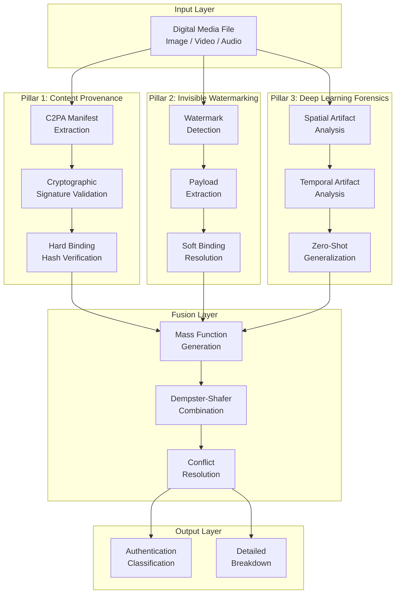

---

## 2. The Three Pillars of Authentication

### 2.1 Pillar One: Content Provenance (C2PA)

**What is C2PA?**
C2PA stands for the **Coalition for Content Provenance and Authenticity**. It is an open technical standard that records the history of a digital media file.

**How it works:**
- When media is created or edited by a C2PA-compliant tool, a **manifest** is attached to the file.
- This manifest contains **assertions** — statements about the media such as:
  - What software created it
  - Whether AI was involved
  - What edits were performed
  - When it was created
- The manifest is cryptographically **signed** using Public Key Infrastructure (PKI). This means any tampering with the manifest is detectable.
- A **hard binding** (a cryptographic hash) connects the manifest to the actual media pixels. If even one pixel changes, the hash no longer matches, and the manifest becomes invalid.

#### C2PA Manifest Structure

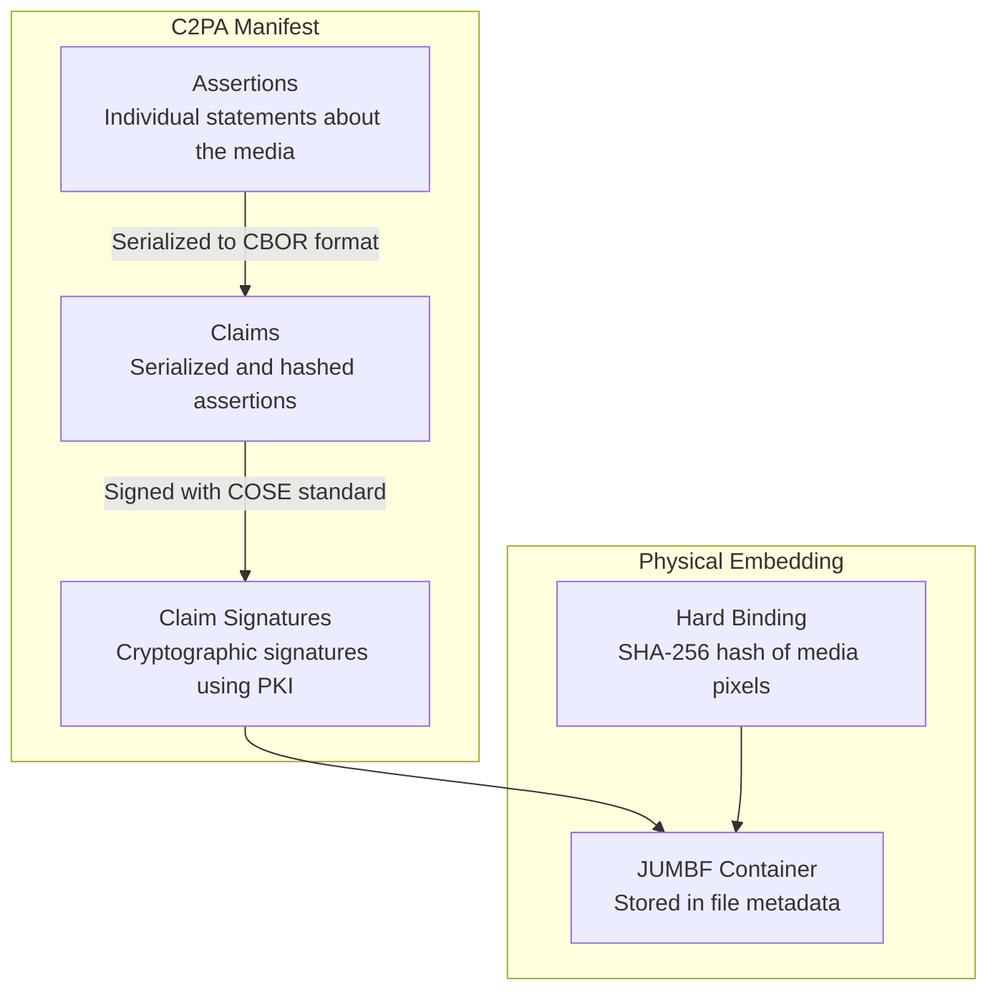

#### C2PA Verification Flow

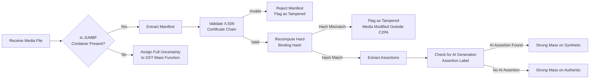

**What is it good at?**
- Provides **definitive proof** of origin when the manifest is intact.
- Establishes a **chain of custody** from creation to distribution.
- Meets **regulatory requirements**, such as the EU AI Act.

**What is its weakness?**
- Social media platforms and content delivery networks routinely **strip metadata** from uploaded files to save bandwidth.
- When the manifest is removed, the cryptographic proof is lost entirely.

#### Hard Binding vs Soft Binding


---

### 2.2 Pillar Two: Invisible Digital Watermarking

**What is invisible watermarking?**
Invisible watermarking embeds a hidden signal directly into the **pixels of an image**, the **frames of a video**, or the **waveform of audio**. The signal is imperceptible to humans but detectable by specialized software.

**What is stored in a watermark?**
Typical payloads include:
- A unique content identifier
- The name or identifier of the generating AI model
- A timestamp of creation
- A reference to external provenance records

#### Watermarking Methods Comparison


#### Gaussian Shading: Embedding and Extraction


#### Watermark Attack Surface

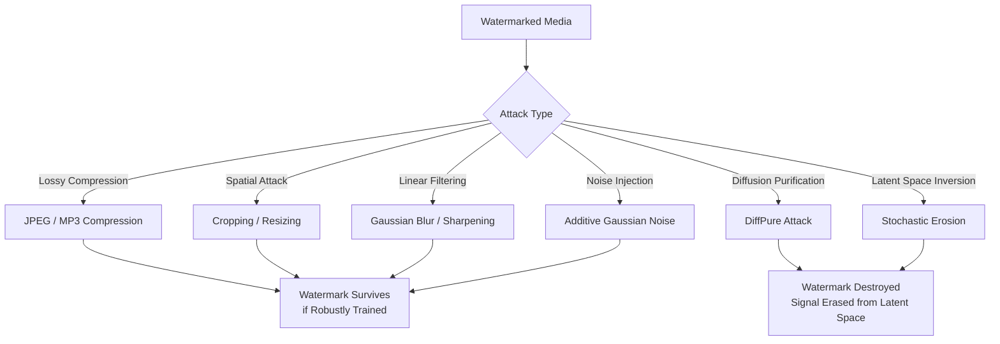

**What is it good at?**
- Survives **metadata stripping** because the watermark lives in the media itself, not the header.
- Can carry **large payloads** (up to 256 bits).
- Can serve as a **soft binding** — a recovery pointer to retrieve a stripped C2PA manifest from a remote store.

**What is its weakness?**
- **Diffusion purification attacks** (like DiffPure) can erase watermarks.
  - The attacker adds controlled noise to the image.
  - Then uses a generative model to reconstruct a clean version.
  - The visual content remains similar, but the watermark signal is destroyed.
- Active **optimization-based attacks** can also erode watermark boundaries.

---

### 2.3 Pillar Three: Deep Learning Forensics

**What is deep learning forensics?**
Deep learning forensics analyzes the **intrinsic properties** of the media itself to detect signs of AI generation. It does not rely on any embedded signal or metadata — it looks at the raw content.

**What does it look for?**
AI generators leave behind subtle artifacts that differ from natural camera-captured media:

- **Spatial Artifacts:**
  - Unnatural texture patterns
  - Inconsistent fine details
  - Irregular edges
  - Abnormal frequency distributions
  - Inconsistent lighting

- **Temporal Artifacts (for video):**
  - Inconsistent blinking rates
  - Unnatural micro-expressions
  - Jitter or instability between frames
  - Unstable background illumination across frames

#### Deep Learning Forensic Pipeline

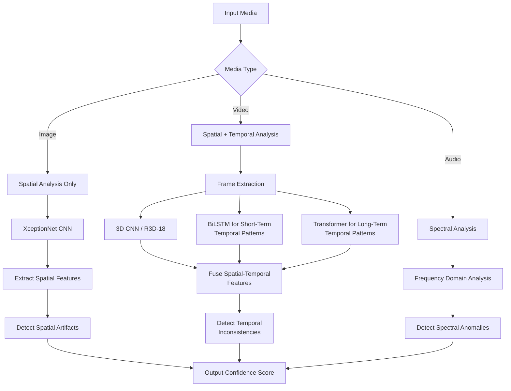

#### Model Architecture Comparison

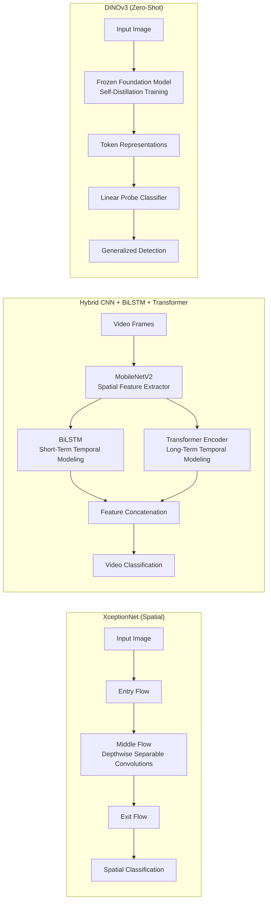

#### Performance Across Datasets

| Model | FaceForensics++ (AUC) | Celeb-DF V2 (AUC) | WildDeepfake (AUC) |
|-------|----------------------|-------------------|-------------------|
| XceptionNet (Base) | 98.00% | 89.91% | ~65.00% |
| EfficientNet B4 | 99.10% | 91.50% | ~68.00% |
| DFDT (Vision Transformer) | 99.41% | 99.31% | 81.35% |

#### The Cross-Generator Generalization Gap

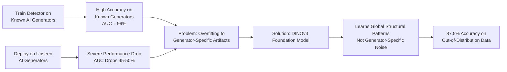

**What is it good at?**
- Works **without any metadata or embedded signal**.
- Cannot be removed by stripping or purification — it analyzes what remains.
- Can detect **previously unseen** AI generators when using foundation models.

**What is its weakness?**
- Outputs **probabilistic scores**, not definitive proof.
- Suffers from **cross-generator generalization gap**: models trained on one AI generator may fail on a newer one.
- Can produce **false positives** if the media is heavily compressed or degraded.

---

## 3. The Fusion Layer: Dempster-Shafer Theory

### 3.1 Why Do We Need Fusion?

Each pillar has a different failure mode:

| Pillar | Primary Failure Mode |
|--------|---------------------|
| C2PA Provenance | Metadata stripping by platforms |
| Invisible Watermark | Diffusion purification attacks |
| Deep Learning Forensics | False positives, generalization gap |

No single method is reliable on its own. Fusion allows the system to **combine weak signals** and **resolve conflicts** between pillars.

#### Single-Layer vs Multi-Layer Defense

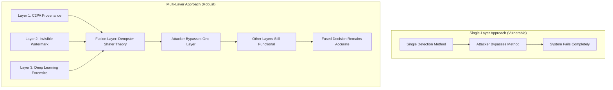

### 3.2 What is Dempster-Shafer Theory?

Dempster-Shafer Theory (DST) is a mathematical framework for **combining evidence from multiple sources** under conditions of uncertainty.

Key concepts:

- **Frame of Discernment:** The set of all possible states. In our case:
  - `{Authentic, Synthetic}`

- **Power Set:** All possible subsets of the frame, including:
  - `{Authentic}`
  - `{Synthetic}`
  - `{Authentic, Synthetic}` — this represents **uncertainty** (we don't know which one)

- **Mass Function:** Assigns a value between 0 and 1 to each element of the power set, representing how much evidence supports that particular state.

- **Belief:** The total mass that directly supports a hypothesis.

- **Plausibility:** The total mass that does not contradict a hypothesis.

- **Uncertainty Interval:** The gap between Belief and Plausibility, representing how uncertain we are.

#### DST Core Concepts Visualization

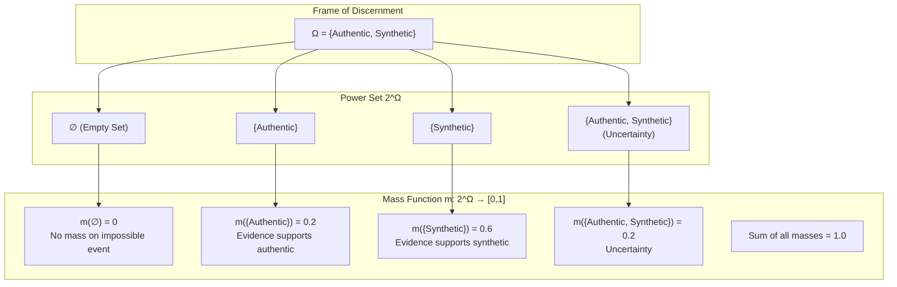

#### Belief and Plausibility

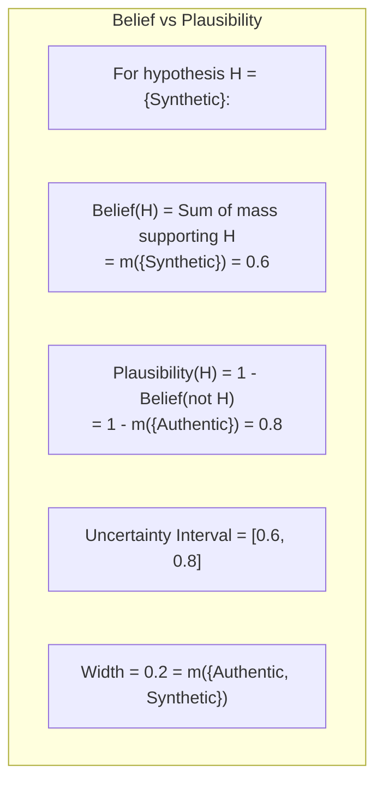

### 3.3 How We Use DST

Each pillar produces a mass function:

**C2PA Provenance Mass Function:**
- If a valid manifest exists and declares AI generation → strong mass on `{Synthetic}`
- If no manifest exists → all mass on `{Authentic, Synthetic}` (complete uncertainty)
- Absence of metadata does **not** mean the media is authentic. It means we don't know.

**Watermark Mass Function:**
- If a watermark is detected and verified → strong mass on `{Synthetic}`
- If no watermark is detected → mostly uncertainty, because the watermark may have been removed

**Deep Learning Forensics Mass Function:**
- Outputs a confidence score (e.g., 80% confident it is synthetic)
- Maps this score to a mass function with a dynamically calculated uncertainty margin

#### Mass Function Generation from Each Pillar

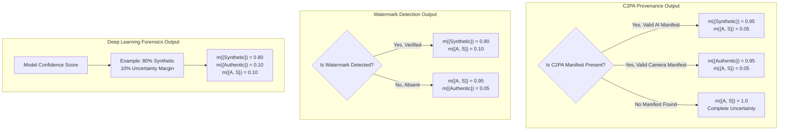

### 3.4 Combining Evidence

Dempster's Rule of Combination merges two mass functions into one:

- Calculate the product of overlapping masses.
- Identify **conflict** (mass assigned to impossible intersections, like Authentic ∩ Synthetic).
- Normalize the result by dividing by (1 - conflict).

The result is a **fused mass function** that represents the combined belief across all three pillars.

#### Dempster's Rule of Combination

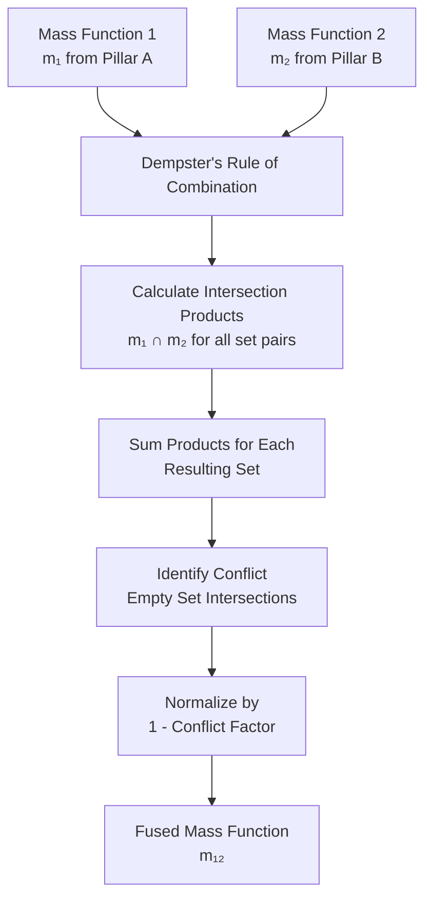

#### Sequential Fusion Process

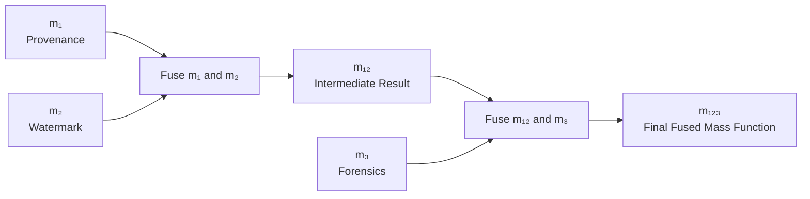

### 3.5 Worked Example: Evasion Attack Resolution

Consider a sophisticated evasion attack:

1. **Adversary generates a realistic deepfake video.**
2. **Adversary uploads to social media platform.**
   - Platform strips C2PA manifest → Provenance detects nothing.
3. **Adversary applies DiffPure before upload.**
   - Watermark is degraded → Watermark detection is inconclusive.
4. **Temporal artifacts remain in video sequence.**
   - 3D CNN detects inconsistencies → Forensics signals synthetic.

#### Evidence Fusion Worked Example

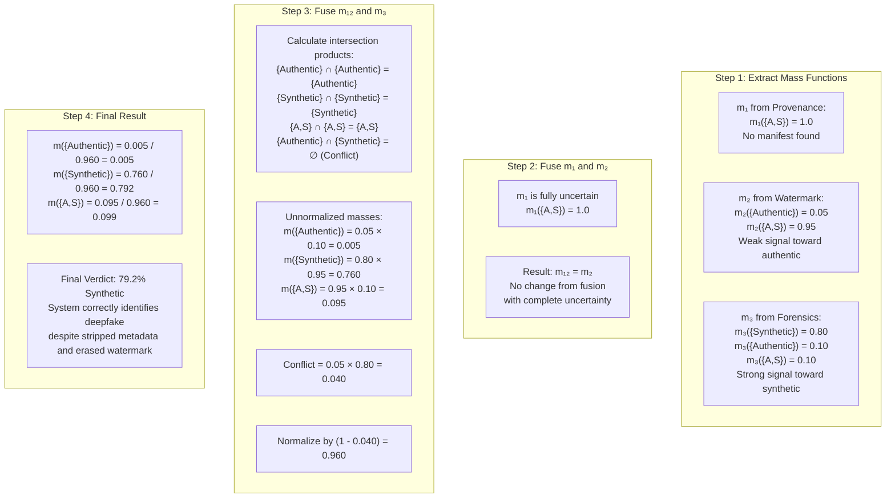

---

## 4. System Architecture

### 4.1 High-Level Design

The system consists of:

1. **Input Module:** Accepts image, video, or audio files for analysis.

2. **Provenance Extraction Module:**
   - Parses the file for C2PA manifest data.
   - Validates cryptographic signatures.
   - Queries remote manifest stores if a soft binding watermark is detected.

3. **Watermark Detection Module:**
   - Runs Gaussian Shading extraction (DDIM inversion + DCT analysis).
   - Runs InvisMark decoder for neural network watermarks.
   - Runs SynthID statistical analysis for text/audio.

4. **Deep Learning Forensics Module:**
   - Runs XceptionNet for spatial artifact detection.
   - Runs 3D CNN for temporal artifact detection in video.
   - Runs DINOv3-based detector for zero-shot generalization.

5. **Fusion Engine:**
   - Converts each module's output into a mass function.
   - Applies Dempster's Rule of Combination sequentially.
   - Produces final fused mass function.

6. **Output Classification Module:**
   - Maps the fused mass function to a human-readable status.
   - Returns detailed breakdown of each pillar's contribution.

#### Complete System Architecture

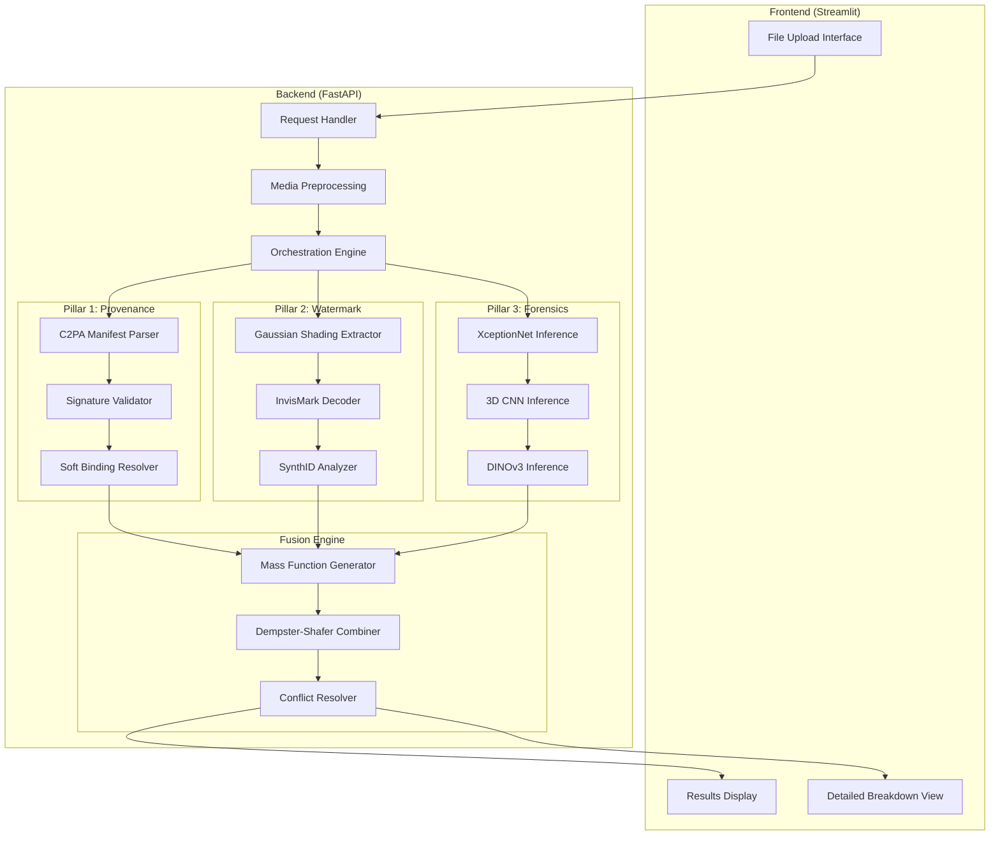

### 4.2 Output Classification Matrix

| Output Status | Condition | Interpretation |
|---------------|-----------|----------------|
| **Verified AI Origin** | Strong mass on Synthetic, driven by provenance or watermark | Cryptographic or watermark proof confirms AI generation |
| **Provenance Available** | Strong mass on Authentic, driven by provenance | Cryptographic proof confirms human/camera origin |
| **Suspicious** | Weak provenance, forensic model detects artifacts | Metadata/watermarks stripped, but neural analysis indicates manipulation |
| **Unknown** | All signals ambiguous or contradictory | Cannot make a reliable determination |

#### Output Classification Decision Tree

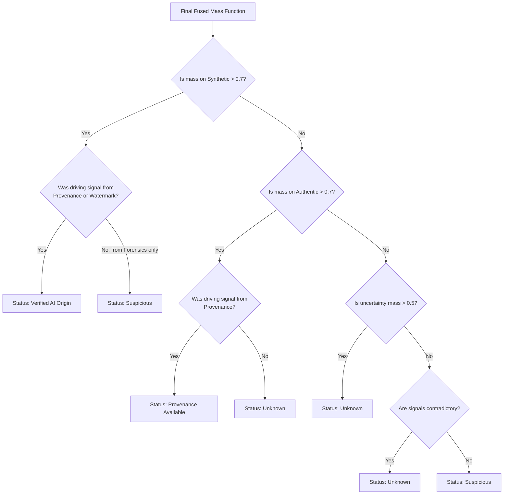

### 4.3 Hardware Requirements

| Component | Minimum Specification |
|-----------|----------------------|
| Processor | Intel i5 or AMD Ryzen 5 (or higher) |
| RAM | 16 GB |
| GPU | NVIDIA GPU with 6 GB VRAM (for deep learning inference) |
| Storage | 512 GB NVMe SSD |

### 4.4 Software Stack

| Component | Technology |
|-----------|------------|
| Programming Language | Python 3.x |
| Deep Learning Framework | PyTorch |
| Image/Video Processing | OpenCV, Pillow |
| Numerical Computation | NumPy, SciPy |
| Data Management | Pandas |
| Frontend Interface | Streamlit |
| Backend API | FastAPI |
| Version Control | Git, GitHub |

#### Software Stack Diagram

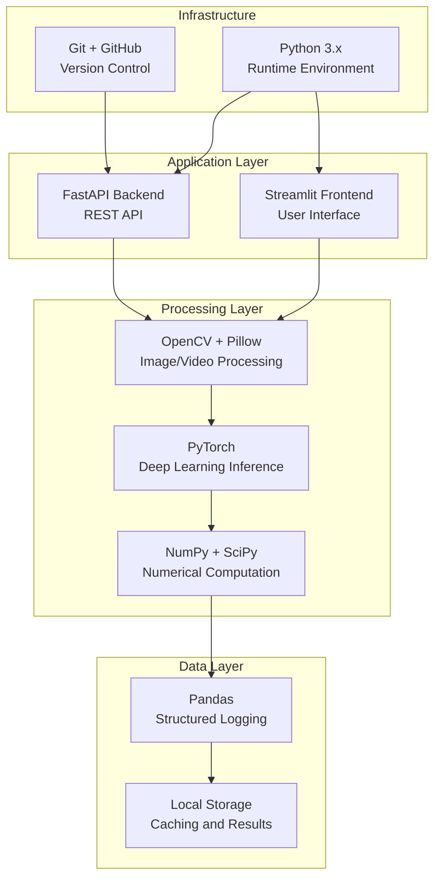

---

## 5. Workflow

### 5.1 Media Submission
User uploads a file (image, video, or audio) through the frontend interface.

### 5.2 Parallel Analysis
The backend processes the file through all three pillars:

- **Provenance Module:** Checks for C2PA manifest, validates signatures.
- **Watermark Module:** Attempts to extract and verify hidden watermarks.
- **Forensics Module:** Runs deep learning models to detect artifacts.

### 5.3 Evidence Fusion
Outputs from all three modules are converted to mass functions and combined using Dempster-Shafer Theory.

### 5.4 Result Generation
The fused result is mapped to one of four output statuses and displayed to the user with detailed breakdowns.

#### End-to-End Workflow

```mermaid
sequenceDiagram
    participant U as User
    participant FE as Frontend
    participant BE as Backend
    participant PM as Provenance Module
    participant WM as Watermark Module
    participant FM as Forensics Module
    participant F as Fusion Engine
    participant DB as Output Display
    
    U->>FE: Upload media file
    FE->>BE: Send file for analysis
    
    BE->>PM: Extract provenance
    BE->>WM: Detect watermark
    BE->>FM: Run forensic analysis
    
    PM-->>BE: Return mass function m₁
    WM-->>BE: Return mass function m₂
    FM-->>BE: Return mass function m₃
    
    BE->>F: Send all mass functions
    F->>F: Apply Dempster's Rule
    F->>F: Resolve conflicts
    F-->>BE: Return fused result
    
    BE->>DB: Map to classification
    DB->>FE: Display result
    FE->>U: Show authentication status
```

---

## 6. Why This Framework is Better

### 6.1 Structural Redundancy
No single point of failure. If one pillar is defeated, others remain functional.

### 6.2 Handles Uncertainty Properly
Unlike traditional systems that force binary decisions, DST explicitly models uncertainty. The system can say "I don't know" rather than making an incorrect guess.

### 6.3 Resolves Conflicting Evidence
When pillars disagree (e.g., no watermark but strong forensic signal), DST mathematically resolves the conflict and produces a rational combined result.

### 6.4 Adaptable to Future Threats
- The forensic layer can be updated with new models as AI generators evolve.
- The fusion layer is algorithm-agnostic — new detection methods can be added as additional mass functions.

### 6.5 Regulatory Compliance
The C2PA layer directly addresses requirements from:
- EU AI Act Article 50 (transparency obligations for AI-generated content)
- Industry standards for content provenance

#### Framework Advantages Visualization

```mermaid
flowchart LR
    subgraph Traditional["Traditional Approach"]
        T1[Single Method] --> T2[Binary Decision]
        T2 --> T3[Real or Fake]
        T3 --> T4[No Uncertainty Quantification]
        T4 --> T5[High False Positive Rate]
    end
